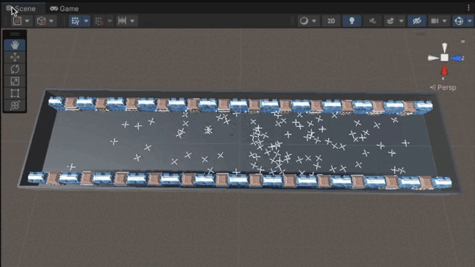
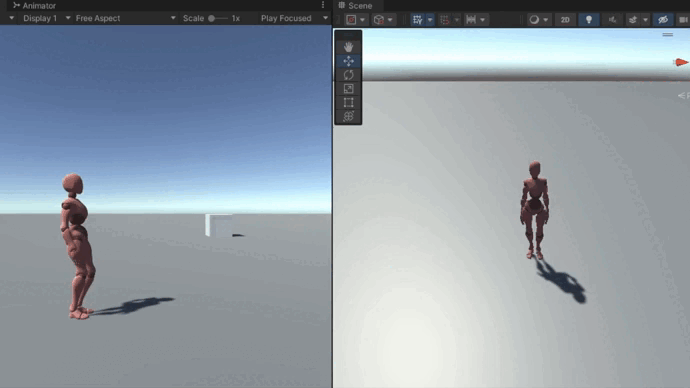

# TwinCity project

## 🎯 Goal

Dive into the fabulous world of the metaverse and VR by re-creating a city and its population 👾

## 🔋 Stack
I think my program will be multilingual and composed of:
- Unity
- C#
- Python

## 📝 Generale organization

My project is currently composed of a Game Object (GO) called "MapGenerator" taking in parameters:
- a structure "THELEVEL:level" which will allow me to store all my GOs created at runtime
- a file "level:map.txt" composed of :
	- f: ground
	- walls (created automatically around the map)
	- c: characters constituting the crowd
	- p: single player which will direct the camera and the user's movements
	- b: buildings<br/>

<br/>Currently, my player is a woman and my characters are ninjas because ninjas are cool 🥷<br/>

Example of the content of a very simple map file: 
```
ffffffffff/
ffcffffffb/
fcfffcfffb/
fffffcfffb/
fffcfcfffb/
fbffpfcffb/
ffffffcffb/
bbbbffbbbb/
ffffffffff/
```

Example of an animated map seen from above:
<p align="center">
	
</p>

## ✅ Done
- [x] generate random crowd made of clones
- [x] AI controlling each clone
- [x] map parser
- [x] character controller (can be improved): can walk, run, rotate
- [x] square / rectangular map parser

Demo of the simulation with my new characters controllers:
<!-- <p align="center">
	
</p> -->

<p align="center">
	
</p>

## 👩🏻‍🔧 To do
- [ ] improve my lighting + shadows
- [ ] count the number of people on a video and reproduce this number in my map -> I think I'm going to use [OpenCV-Python](https://pyimagesearch.com/2018/08/13/opencv-people-counter/) 🐍
- [ ] reproduce movements captured in a video
- [ ] create a small town that really exists
- [ ] improve map parser to manage non-square maps

## 💬 Unity vocabulary

Selected object: game object<br/>
Game object (GO) has differents components.<br/>
Assets folder: folder where we're gonna code our game.<br/>

#### When you start a new game, two game objects are already present:
- the camera
- the directionnal light (to light up our scene)

#### Some information about components:
- Transform: define position / scale / rotation... of the GO
- You can add components: C# scripts (or other), rigidbody & box collider for collisions...
- Mash renderer: to show/hide the GO

#### Some tools:
- scale tool: to manually resize a game object
- rotate tool
- move tool
- ...

Dimensions are defined by x, y, z (-> depth)<br/>

#### Material
Contains properties / settings. Can be applied to several GO<br/>

#### Heritage
Game object child / parent -> drag and drop a GO onto another to make it its child. Positions will be linked.<br/>
Useful for the camera to follow a defined character.<br/>

## 💬 C# vocabulary

#### Global definition

Object-oriented language + typed language.<br/>
Derived from C/C++, looks like Java.<br/>
 It is used to develop web applications, as well as desktop applications, web services, commands, widgets or class libraries ([learn more](https://fr.wikipedia.org/wiki/C_sharp)).<br/>

#### Difference public / private
When a variable in a script is public, it appears on Unity and it can be modified during tests (≠ private).<br/>
Interesting if you want to try different values in test phase but not in production 🤪<br/>

#### Some instructions & keywords
- Quaternion: basic rotation
- GameObject = -> to instantiate a new GO (use Instantiate(...)), clones...
- Vector3: creates a vector whose elements have the specified values
- transform.Translate(...) -> to move a GO in the direction and distance of translation
- Time.FixedDelta: expected time interval that physic simulation process should follow

## 🖇 Reference
- [Bases of Unity & C#](https://www.youtube.com/watch?v=oeiYBMMWU40&t=343s&ab_channel=LaTechavecBertrand)
- [Prefab & Game Objects store](https://assetstore.unity.com/)
- [Simple Crowd AI in Unity 3D](https://www.youtube.com/watch?v=4CCAvUqAC7k&ab_channel=negleft)
- [Map parser](https://www.youtube.com/watch?v=uQys5CLDIRE&ab_channel=baptistekleber)
- The Unity God, very useful to learn movements and animation: [iHeartGameDev](https://www.youtube.com/c/iHeartGameDev/featured)
- [Mixamo: Animate 3D characters](https://www.mixamo.com/#/)
- [OpenCV-Python](https://docs.opencv.org/3.4/d0/de3/tutorial_py_intro.html)

<!-- cas d'usage :
comptage de foule
dépôt d'ordures sauvages
malaises 

jumeaux numériques de villes

donnée synthétique

améliorer sécurité citoyens dans espace public
en mettant à dispo systèmes d'acquisition de données (= l'image ici -> caméras de  vidéoprotection)

Ce qu'ils ont : reproduisent ville dans moteur de jeu open source pour générer leurs problèmes dans un jeu / générer des données synthétiques

données très volumineuses mais peuvent pas entrainer algo d'apprentissage car données = protégées

création d'un monde parallèle, automatisé, transparent pour citoyen

bureau valorisation donnée ministère composé de data scientists, anciens EIG
environnement pluridisciplinaire, traitement donnée

Objectifs : + de transparence pour usager concernant vidéoprotection grâce à plateforme de démo + proposer un tas d'usage aux SP qui veulent s'en servir

Pas de reconnaissance faciale

Possibilité de poursuivre le projet

Comptage approximatif
Taux de fiabilité à renseigner ?

-->
